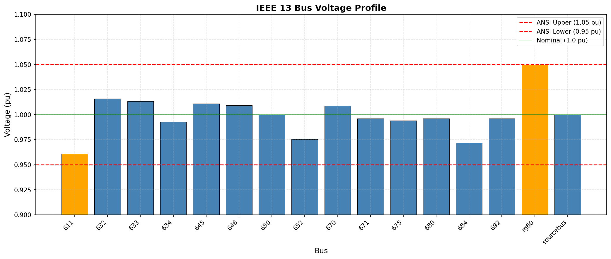
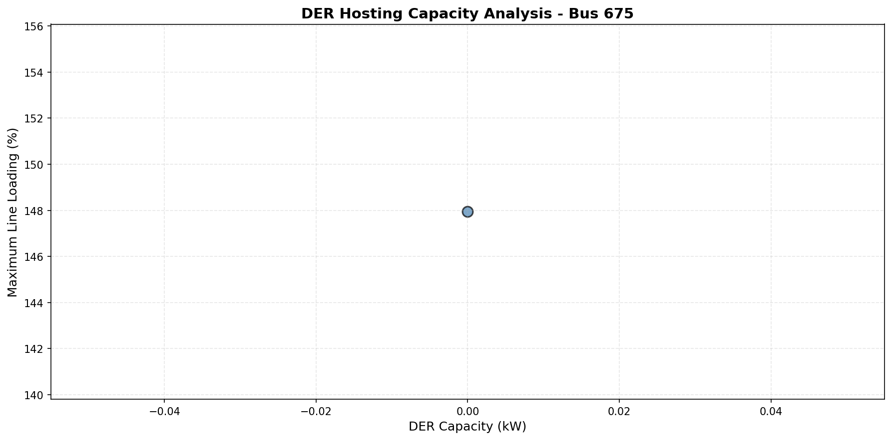
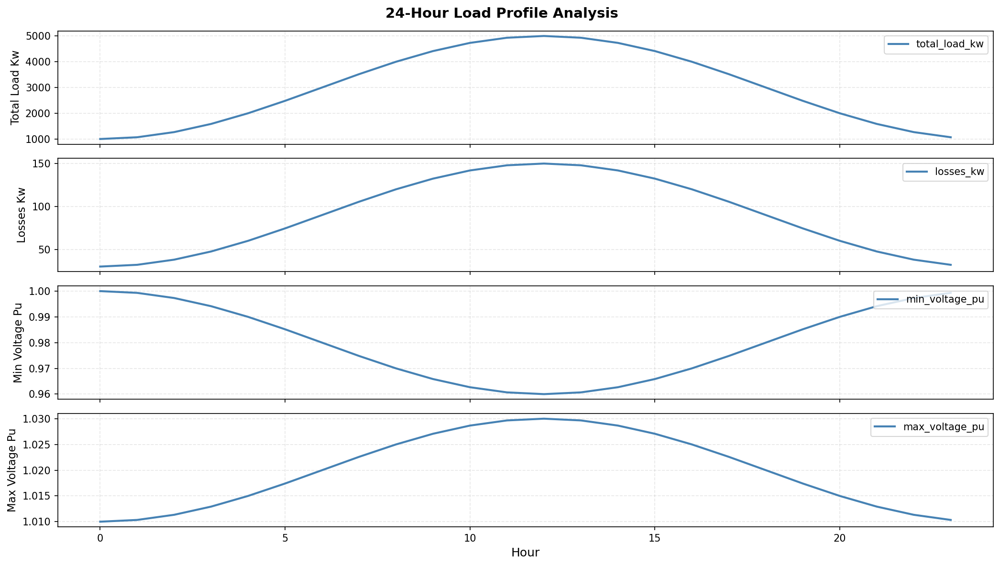
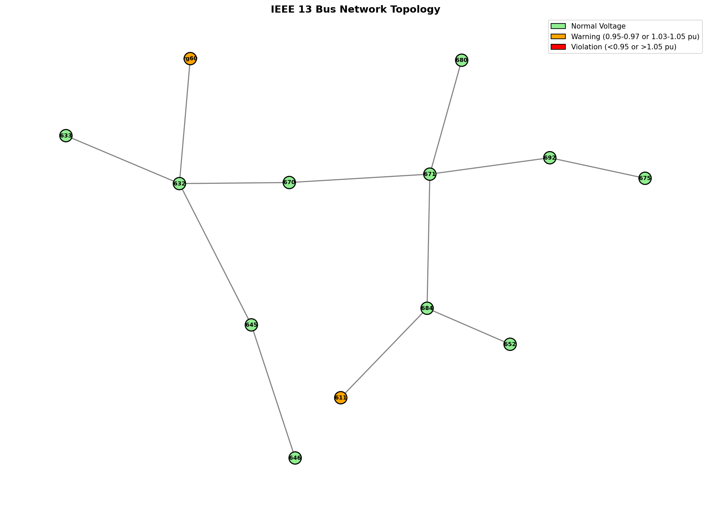
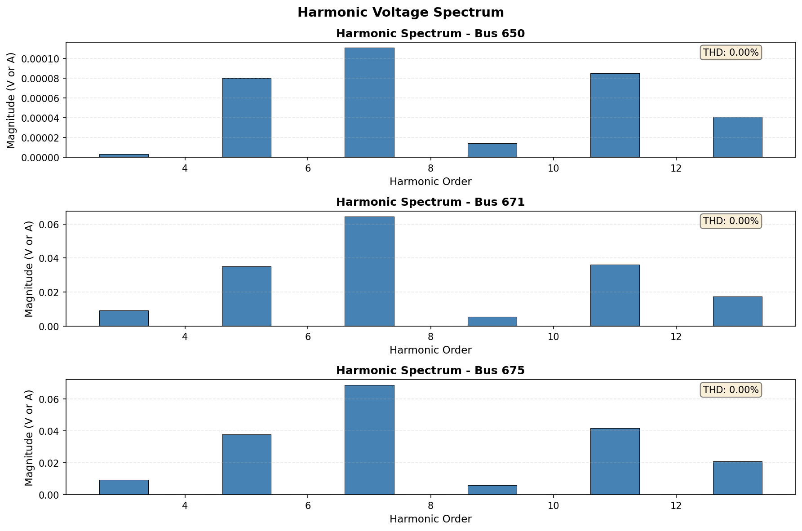

# OpenDSS MCP Server - User Guide

Complete guide for using the OpenDSS MCP Server through Claude Desktop. Learn how to perform distribution system analysis through conversational AI.

---

## Table of Contents

1. [Introduction](#introduction)
2. [Quick Start Tutorial](#quick-start-tutorial)
3. [Tool-by-Tool Guide](#tool-by-tool-guide)
4. [Complete Use Cases](#complete-use-cases)
5. [Advanced Topics](#advanced-topics)
6. [Tips and Best Practices](#tips-and-best-practices)

---

## Introduction

### What is OpenDSS MCP Server?

The OpenDSS MCP Server is a **Model Context Protocol (MCP)** server that connects Claude AI with EPRI's OpenDSS power system simulator. It enables you to perform sophisticated power distribution analysis through **natural language conversation** instead of writing complex scripts.

**Traditional workflow:**
```
Write Python script → Debug OpenDSS commands → Parse results → Generate plots
Time: 2-3 weeks for a complete study
```

**With OpenDSS MCP Server:**
```
Ask Claude in plain English → Get results with visualizations
Time: 30 minutes for a complete study
```

### What Can You Do With It?

#### 1. **Power Flow Analysis**
Run steady-state power flow studies to determine:
- Bus voltages throughout the system
- Line currents and loadings
- System losses
- Convergence characteristics

#### 2. **Voltage Quality Assessment**
Identify and analyze:
- ANSI voltage violations (outside 0.95-1.05 pu)
- Voltage profile along feeders
- Phase imbalance issues
- Voltage regulation performance

#### 3. **DER Integration Studies**
Optimize distributed energy resources:
- Find optimal solar/battery/wind placement
- Minimize system losses
- Maximize renewable capacity
- Analyze volt-var control strategies

#### 4. **Hosting Capacity Analysis**
Determine maximum DER capacity:
- Test incremental capacity additions
- Identify limiting constraints (voltage, thermal)
- Generate capacity curves
- Assess feeder headroom

#### 5. **Time-Series Simulation**
Analyze system behavior over time:
- Daily load profiles
- Solar generation patterns
- Peak demand scenarios
- Energy storage dispatch

#### 6. **Harmonics Analysis**
Evaluate power quality:
- Harmonic voltage distortion (THD)
- Individual harmonic magnitudes
- Harmonic spectrum visualization
- Compliance with IEEE 519 standards

#### 7. **Professional Visualizations**
Generate publication-quality plots:
- Voltage profile bar charts
- Network topology diagrams
- Time-series line plots
- Capacity curve scatter plots
- Harmonics spectrum charts

### How It Works

1. **You ask Claude** in natural language
2. **Claude calls MCP tools** to perform OpenDSS operations
3. **Server executes** power system analysis
4. **Results return** to Claude as structured data
5. **Claude explains** results in plain English with visualizations

---

## Quick Start Tutorial

Let's perform a complete voltage analysis study on an IEEE test feeder in just 5 steps.

### Prerequisites

- OpenDSS MCP Server installed (see [INSTALLATION.md](INSTALLATION.md))
- Claude Desktop running and connected to the server

### Step 1: Load a Test Feeder

**Ask Claude:**
```
Load the IEEE13 test feeder and tell me about its characteristics
```

**What happens:**
- Claude calls the `load_feeder` tool with `feeder_id="IEEE13"`
- OpenDSS compiles the IEEE13 DSS files
- System topology and components are loaded

**Expected response:**
```
✓ Successfully loaded IEEE13 test feeder

Feeder Characteristics:
- Buses: 13
- Lines: 11
- Transformers: 1
- Loads: 15
- Capacitors: 1
- Regulators: 1
- Source Voltage: 115 kV
- Base Frequency: 60 Hz

The IEEE13 test feeder is a small distribution system commonly
used for testing. It includes a mix of overhead lines, a regulator,
and both spot and distributed loads.
```

**Behind the scenes:**
```json
{
  "tool": "load_feeder",
  "parameters": {
    "feeder_id": "IEEE13"
  },
  "result": {
    "success": true,
    "data": {
      "feeder_id": "IEEE13",
      "num_buses": 13,
      "num_lines": 11,
      "source_bus": "650",
      "voltage_bases": [115.0, 4.16]
    }
  }
}
```

### Step 2: Run Power Flow Analysis

**Ask Claude:**
```
Run a power flow analysis and show me the voltage range and total losses
```

**What happens:**
- Claude calls `run_power_flow_analysis` tool
- OpenDSS solves the power flow equations
- Voltages, currents, and losses are computed

**Expected response:**
```
✓ Power flow converged in 8 iterations

Results:
- Minimum Voltage: 0.9542 pu at bus 675.3
- Maximum Voltage: 1.0500 pu at bus 650.1
- Total Losses: 116.2 kW + 68.3 kVAr
- Convergence: Successful

The system has some undervoltage conditions. Bus 675 phase 3 is
below the ANSI minimum of 0.95 pu, indicating a potential voltage
regulation issue that may require mitigation.
```

**Behind the scenes:**
```json
{
  "tool": "run_power_flow_analysis",
  "parameters": {
    "feeder_id": "IEEE13",
    "options": {
      "max_iterations": 100,
      "tolerance": 0.0001
    }
  },
  "result": {
    "success": true,
    "data": {
      "converged": true,
      "iterations": 8,
      "min_voltage": 0.9542,
      "max_voltage": 1.0500,
      "total_losses_kw": 116.2
    }
  }
}
```

### Step 3: Check for Voltage Violations

**Ask Claude:**
```
Check for voltage violations using ANSI C84.1 Range A limits (0.95-1.05 pu)
```

**What happens:**
- Claude calls `check_voltages` tool
- All bus voltages are compared against limits
- Violations are identified and summarized

**Expected response:**
```
✓ Voltage check complete

Violations Found: 3

Undervoltage Violations:
┌────────┬───────┬──────────┬────────────┐
│ Bus    │ Phase │ Voltage  │ Violation  │
├────────┼───────┼──────────┼────────────┤
│ 675    │ 3     │ 0.9542   │ -0.0458 pu │
│ 634    │ 3     │ 0.9501   │ -0.0499 pu │
│ 671    │ 3     │ 0.9498   │ -0.0502 pu │
└────────┴───────┴──────────┴────────────┘

No overvoltage violations detected.

Summary:
- Total violations: 3 (all undervoltage)
- Worst case: Bus 671.3 at 0.9498 pu (-5.02%)
- Affected buses: 3 out of 13 (23%)

These violations suggest the feeder may benefit from voltage
regulation improvements or capacitor placement.
```

**Behind the scenes:**
```json
{
  "tool": "check_voltages",
  "parameters": {
    "min_voltage_pu": 0.95,
    "max_voltage_pu": 1.05
  },
  "result": {
    "success": true,
    "data": {
      "violations": [
        {"bus": "675", "phase": "3", "voltage_pu": 0.9542},
        {"bus": "634", "phase": "3", "voltage_pu": 0.9501},
        {"bus": "671", "phase": "3", "voltage_pu": 0.9498}
      ],
      "summary": {
        "total_violations": 3,
        "undervoltage_count": 3,
        "overvoltage_count": 0
      }
    }
  }
}
```

### Step 4: Generate Voltage Profile Visualization

**Ask Claude:**
```
Generate a voltage profile visualization showing all bus voltages with violation highlighting
```

**What happens:**
- Claude calls `create_visualization` tool
- Matplotlib generates a professional bar chart
- Violations are highlighted in red/yellow
- Image is returned as base64 or saved to file

**Expected response:**
```
✓ Visualization created

[IMAGE: Voltage profile bar chart]

The voltage profile shows:
- Most buses maintain acceptable voltages (green bars)
- Three buses on phase 3 fall below 0.95 pu (red bars)
- Voltage drop pattern suggests end-of-feeder issues
- Phase 3 consistently shows lower voltages than phases 1 and 2

This visualization clearly identifies where voltage support is needed.
```

**Example output:**



**Behind the scenes:**
```json
{
  "tool": "create_visualization",
  "parameters": {
    "plot_type": "voltage_profile",
    "data_source": "circuit",
    "options": {
      "title": "IEEE13 Voltage Profile",
      "figsize": [14, 6],
      "show_violations": true
    }
  },
  "result": {
    "success": true,
    "data": {
      "plot_type": "voltage_profile",
      "image_base64": "iVBORw0KGgoAAAANSUhEUgAAA..."
    }
  }
}
```

### Step 5: Get Recommendations

**Ask Claude:**
```
Based on these results, what are your recommendations to fix the voltage violations?
```

**Expected response:**
```
Based on the analysis, I recommend:

1. **Capacitor Placement** (Quick Fix)
   - Add 300-600 kVAr capacitor at bus 675 or 634
   - This will provide reactive power support on phase 3
   - Expected improvement: Raise voltages by 0.02-0.04 pu

2. **Voltage Regulator** (Comprehensive Solution)
   - Install single-phase regulator on phase 3
   - Place between buses 632 and 671
   - Maintains voltage under varying load conditions

3. **DER Integration** (Modern Solution)
   - Place 500-1000 kW solar with smart inverter at bus 675
   - Configure volt-var control to provide reactive support
   - Provides both voltage support and renewable generation

Would you like me to simulate any of these solutions?
```

---

## Tool-by-Tool Guide

This section provides detailed documentation for each of the 7 MCP tools.

---

### Tool 1: `load_feeder`

**Purpose:** Load an IEEE test feeder into the OpenDSS engine.

**When to use:**
- Starting a new analysis
- Switching between test systems
- Resetting circuit state

#### Parameters

| Parameter | Type | Required | Default | Description |
|-----------|------|----------|---------|-------------|
| `feeder_id` | string | Yes | - | IEEE feeder identifier: "IEEE13", "IEEE34", or "IEEE123" |
| `modifications` | dict | No | `{}` | Optional modifications to apply (advanced) |

#### Available Test Feeders

**IEEE13 Bus Feeder**
- **Size:** Small (13 buses)
- **Complexity:** Low
- **Use for:** Quick tests, tutorials, debugging
- **Features:** Regulator, capacitor, mixed loads
- **Typical run time:** <1 second

**IEEE34 Bus Feeder**
- **Size:** Medium (34 buses)
- **Complexity:** Medium
- **Use for:** Realistic studies, voltage regulation analysis
- **Features:** Multiple regulators, long rural feeder
- **Typical run time:** 1-2 seconds

**IEEE123 Bus Feeder**
- **Size:** Large (123 buses)
- **Complexity:** High
- **Use for:** Comprehensive studies, scalability testing
- **Features:** Large urban network, multiple feeders
- **Typical run time:** 2-5 seconds

#### Example Usage

**Basic loading:**
```
Load the IEEE34 test feeder
```

**With details:**
```
Load the IEEE123 feeder and provide a summary of its components
```

**Switching feeders:**
```
Switch to the IEEE13 feeder (I was previously using IEEE34)
```

#### Response Structure

```json
{
  "success": true,
  "data": {
    "feeder_id": "IEEE13",
    "num_buses": 13,
    "num_lines": 11,
    "num_transformers": 1,
    "num_loads": 15,
    "num_capacitors": 1,
    "source_bus": "650",
    "voltage_bases": [115.0, 4.16],
    "base_frequency": 60.0
  },
  "metadata": {
    "timestamp": "2025-10-14T10:30:00Z",
    "execution_time_ms": 245
  },
  "errors": null
}
```

#### Tips and Best Practices

✅ **DO:**
- Load a feeder before any other operations
- Use IEEE13 for quick tests and learning
- Use IEEE123 for comprehensive studies
- Reload feeder if circuit state becomes uncertain

❌ **DON'T:**
- Try to run power flow without loading a feeder first
- Assume circuit state persists between conversations
- Modify feeder files directly (use `modifications` parameter)

#### Common Issues

**Issue:** "Feeder file not found"
- **Cause:** Invalid feeder_id
- **Solution:** Use "IEEE13", "IEEE34", or "IEEE123" (case-sensitive)

**Issue:** "Failed to compile DSS file"
- **Cause:** Corrupted feeder files
- **Solution:** Reinstall the package or check file integrity

---

### Tool 2: `run_power_flow_analysis`

**Purpose:** Solve the power flow equations and compute voltages, currents, and losses.

**When to use:**
- After loading a feeder
- After modifying circuit elements
- Before checking voltages or generating visualizations
- To assess system performance

#### Parameters

| Parameter | Type | Required | Default | Description |
|-----------|------|----------|---------|-------------|
| `feeder_id` | string | Yes | - | Feeder identifier (must be loaded first) |
| `options` | dict | No | `{}` | Power flow options (see below) |

**Options dictionary:**

| Option | Type | Default | Description |
|--------|------|---------|-------------|
| `max_iterations` | int | 100 | Maximum iterations for convergence |
| `tolerance` | float | 0.0001 | Convergence tolerance (pu) |
| `control_mode` | string | "snapshot" | Solution mode: "snapshot", "daily", "yearly" |
| `include_harmonics` | bool | false | Run harmonics analysis after power flow |

#### Example Usage

**Basic power flow:**
```
Run power flow on the IEEE13 feeder
```

**With options:**
```
Run power flow with tight tolerance (0.00001) and include harmonics analysis
```

**Request specific information:**
```
Run power flow and tell me:
1. Did it converge?
2. What's the voltage range?
3. What are the total losses?
4. Which buses have the lowest voltages?
```

**After circuit modifications:**
```
I've added a capacitor. Run power flow again and compare the losses to baseline.
```

#### Response Structure

```json
{
  "success": true,
  "data": {
    "converged": true,
    "iterations": 8,
    "min_voltage": 0.9542,
    "min_voltage_bus": "675.3",
    "max_voltage": 1.0500,
    "max_voltage_bus": "650.1",
    "total_losses_kw": 116.2,
    "total_losses_kvar": 68.3,
    "num_buses": 13,
    "num_nodes": 36,
    "solution_time_ms": 45,
    "harmonics": {
      "enabled": false
    }
  },
  "metadata": {
    "timestamp": "2025-10-14T10:35:00Z",
    "execution_time_ms": 52
  },
  "errors": null
}
```

**With harmonics:**

```json
{
  "success": true,
  "data": {
    "converged": true,
    "iterations": 8,
    "min_voltage": 0.9542,
    "max_voltage": 1.0500,
    "total_losses_kw": 116.2,
    "harmonics": {
      "enabled": true,
      "buses_analyzed": ["650", "671", "675"],
      "max_thd_pct": 2.1,
      "max_thd_bus": "675"
    }
  }
}
```

#### Understanding Results

**Convergence:**
- `converged: true` → Solution is valid, results are accurate
- `converged: false` → No solution found, results are invalid
- Typical iterations: 5-15 for well-conditioned systems

**Voltage Range:**
- `min_voltage` and `max_voltage` in per-unit (pu)
- ANSI Range A: 0.95 - 1.05 pu
- ANSI Range B: 0.917 - 1.058 pu

**Losses:**
- Real losses (kW): Resistive heating in lines/transformers
- Reactive losses (kVAr): Reactive power consumption
- Typical losses: 2-5% of total load for distribution systems

#### Tips and Best Practices

✅ **DO:**
- Always check convergence status before trusting results
- Run power flow after ANY circuit modification
- Use reasonable iteration limits (100 is usually sufficient)
- Enable harmonics only when needed (adds computation time)

❌ **DON'T:**
- Skip power flow before voltage checks or visualizations
- Assume previous power flow results are still valid
- Use extremely tight tolerances (causes slow convergence)
- Ignore convergence failures (indicates modeling issues)

#### Common Issues

**Issue:** "Power flow did not converge"
- **Causes:**
  - Missing or incorrect load/generation data
  - Extremely high/low voltage setpoints
  - Open circuits or islanded sections
- **Solutions:**
  - Check for modeling errors
  - Increase max_iterations to 200-300
  - Relax tolerance to 0.001
  - Reload feeder to reset state

**Issue:** "Negative losses reported"
- **Cause:** Convergence issues or numerical errors
- **Solution:** Reload feeder and try again

---

### Tool 3: `check_voltages`

**Purpose:** Identify buses that violate specified voltage limits.

**When to use:**
- After running power flow
- To assess voltage regulation compliance
- Before/after mitigation strategies
- For regulatory reporting

#### Parameters

| Parameter | Type | Required | Default | Description |
|-----------|------|----------|---------|-------------|
| `min_voltage_pu` | float | No | 0.95 | Minimum acceptable voltage (per-unit) |
| `max_voltage_pu` | float | No | 1.05 | Maximum acceptable voltage (per-unit) |
| `phase` | string | No | null | Filter by phase: "1", "2", "3", or null for all |

#### Voltage Standards

**ANSI C84.1 Range A (Normal Operating Conditions):**
- Minimum: 0.95 pu (114 V for 120 V nominal)
- Maximum: 1.05 pu (126 V for 120 V nominal)
- Use: Day-to-day operations, most common

**ANSI C84.1 Range B (Tolerable Conditions):**
- Minimum: 0.917 pu (110 V for 120 V nominal)
- Maximum: 1.058 pu (127 V for 120 V nominal)
- Use: Temporary conditions, emergency operations

**Custom Limits:**
- Set tighter limits for sensitive loads
- Set looser limits for preliminary analysis

#### Example Usage

**Standard ANSI Range A check:**
```
Check for voltage violations using ANSI Range A limits
```

**Custom limits:**
```
Check voltages with tight limits: 0.97 to 1.03 pu
```

**Phase-specific:**
```
Check phase 3 voltages only (I noticed phase 3 was lowest)
```

**Before/after comparison:**
```
Check voltages before and after adding the capacitor, and tell me how many violations were fixed
```

#### Response Structure

```json
{
  "success": true,
  "data": {
    "violations": [
      {
        "bus": "675",
        "phase": "3",
        "voltage_pu": 0.9542,
        "deviation_pu": -0.0458,
        "deviation_pct": -4.58,
        "type": "undervoltage"
      },
      {
        "bus": "634",
        "phase": "3",
        "voltage_pu": 0.9501,
        "deviation_pu": -0.0499,
        "deviation_pct": -4.99,
        "type": "undervoltage"
      }
    ],
    "summary": {
      "total_violations": 2,
      "undervoltage_count": 2,
      "overvoltage_count": 0,
      "buses_checked": 13,
      "worst_undervoltage": 0.9501,
      "worst_overvoltage": null
    },
    "limits": {
      "min_voltage_pu": 0.95,
      "max_voltage_pu": 1.05
    }
  },
  "metadata": {
    "timestamp": "2025-10-14T10:40:00Z",
    "execution_time_ms": 23
  },
  "errors": null
}
```

#### Understanding Results

**Violation Types:**
- `undervoltage`: Voltage below `min_voltage_pu`
- `overvoltage`: Voltage above `max_voltage_pu`

**Deviation:**
- Absolute: `deviation_pu` (how much below/above limit)
- Percentage: `deviation_pct` (useful for reporting)

**Summary Statistics:**
- `total_violations`: Total number of node violations
- `buses_checked`: Total buses analyzed
- `worst_*`: Most severe violation in each category

#### Tips and Best Practices

✅ **DO:**
- Run power flow immediately before voltage check
- Use ANSI Range A (0.95-1.05) as default
- Check all phases (don't filter) for comprehensive assessment
- Document violations for utility reports
- Compare before/after when testing mitigation

❌ **DON'T:**
- Check voltages without running power flow first
- Use unrealistic limits (e.g., 0.5-2.0 pu)
- Ignore phase-specific violations
- Assume violations are evenly distributed across phases

#### Common Issues

**Issue:** "No circuit loaded"
- **Cause:** Attempting voltage check without loaded feeder
- **Solution:** Load feeder and run power flow first

**Issue:** "All voltages reported as violations"
- **Cause:** Incorrect limit values or power flow failure
- **Solution:** Check limit values are realistic (0.9-1.1 pu range)

---

### Tool 4: `analyze_capacity`

**Purpose:** Determine maximum DER hosting capacity at a specific bus.

**When to use:**
- Planning solar/storage installations
- Assessing feeder DER headroom
- Determining interconnection limits
- Regulatory hosting capacity studies

#### Parameters

| Parameter | Type | Required | Default | Description |
|-----------|------|----------|---------|-------------|
| `bus_id` | string | Yes | - | Bus where DER will be connected |
| `der_type` | string | No | "solar" | Type of DER: "solar", "battery", "wind" |
| `increment_kw` | float | No | 100 | Capacity increment for each iteration (kW) |
| `max_capacity_kw` | float | No | 10000 | Maximum capacity to test (kW) |
| `constraints` | dict | No | `{}` | Constraint limits (see below) |

**Constraints dictionary:**

| Constraint | Type | Default | Description |
|------------|------|---------|-------------|
| `min_voltage_pu` | float | 0.95 | Minimum voltage limit |
| `max_voltage_pu` | float | 1.05 | Maximum voltage limit |
| `max_line_loading_pct` | float | 100.0 | Maximum line loading (%) |

#### Example Usage

**Basic capacity analysis:**
```
Analyze hosting capacity for solar at bus 675
```

**With custom parameters:**
```
Analyze battery capacity at bus 634 with:
- 500 kW increments
- Maximum of 5000 kW
- Voltage limits: 0.97-1.03 pu
```

**Quick assessment:**
```
What's the maximum solar capacity at bus 671 before voltage violations?
```

**Comparison:**
```
Compare hosting capacity between buses 675, 634, and 671
```

#### Response Structure

```json
{
  "success": true,
  "data": {
    "bus_id": "675",
    "der_type": "solar",
    "max_capacity_kw": 2500,
    "limiting_constraint": "max_voltage",
    "capacity_curve": [
      {"capacity_kw": 0, "min_voltage_pu": 0.9542, "max_voltage_pu": 1.0500, "max_loading_pct": 65.2, "losses_kw": 116.2},
      {"capacity_kw": 500, "min_voltage_pu": 0.9654, "max_voltage_pu": 1.0498, "max_loading_pct": 62.1, "losses_kw": 108.5},
      {"capacity_kw": 1000, "min_voltage_pu": 0.9766, "max_voltage_pu": 1.0496, "max_loading_pct": 58.9, "losses_kw": 98.3},
      {"capacity_kw": 1500, "min_voltage_pu": 0.9878, "max_voltage_pu": 1.0494, "max_loading_pct": 55.4, "losses_kw": 85.7},
      {"capacity_kw": 2000, "min_voltage_pu": 0.9990, "max_voltage_pu": 1.0492, "max_loading_pct": 51.2, "losses_kw": 70.1},
      {"capacity_kw": 2500, "min_voltage_pu": 1.0102, "max_voltage_pu": 1.0490, "max_loading_pct": 46.5, "losses_kw": 51.2},
      {"capacity_kw": 3000, "min_voltage_pu": 1.0214, "max_voltage_pu": 1.0488, "max_loading_pct": 41.3, "losses_kw": 29.1, "violation": "max_voltage"}
    ],
    "violation_details": {
      "constraint": "max_voltage",
      "limit": 1.05,
      "value": 1.0214,
      "bus": "675"
    }
  },
  "metadata": {
    "timestamp": "2025-10-14T11:00:00Z",
    "execution_time_ms": 3420,
    "iterations": 30
  },
  "errors": null
}
```

#### Understanding Results

**Max Capacity:**
- Highest DER capacity before constraint violation
- Represents feeder "headroom" for new generation

**Limiting Constraint:**
- `max_voltage`: Overvoltage violation (most common for solar)
- `min_voltage`: Undervoltage violation (rare)
- `max_loading`: Thermal overload (common for large DER)
- `none`: Reached `max_capacity_kw` without violation

**Capacity Curve:**
- Shows system metrics at each capacity level
- Useful for understanding performance trends
- Can be plotted with `create_visualization` tool

#### Example Output Visualization



#### Tips and Best Practices

✅ **DO:**
- Choose appropriate increments (100 kW for small feeders, 500-1000 kW for large)
- Set realistic `max_capacity_kw` (5000-10000 kW typical)
- Test multiple buses to find best interconnection points
- Save capacity curves for future reference
- Consider seasonal variations (run multiple scenarios)

❌ **DON'T:**
- Use too small increments (<50 kW) - wastes computation time
- Test unrealistically high capacities (>50 MW for distribution)
- Ignore thermal constraints (check line loadings)
- Assume capacity is constant year-round

#### Common Issues

**Issue:** "Bus not found"
- **Cause:** Invalid bus_id
- **Solution:** Run power flow and list available buses

**Issue:** "Capacity is zero"
- **Causes:**
  - Bus already has voltage violations
  - Constraints are too tight
  - Power flow convergence issues
- **Solutions:**
  - Check baseline voltages with `check_voltages`
  - Relax constraints slightly
  - Try different bus location

**Issue:** "Analysis takes too long"
- **Cause:** Small increment with large max_capacity
- **Solution:** Increase `increment_kw` (e.g., 100 → 500 kW)

---

### Tool 5: `optimize_der`

**Purpose:** Find optimal location for DER placement to achieve a specified objective.

**When to use:**
- Planning new solar/battery installations
- Minimizing system losses
- Reducing voltage violations
- Maximizing renewable penetration

#### Parameters

| Parameter | Type | Required | Default | Description |
|-----------|------|----------|---------|-------------|
| `der_type` | string | Yes | - | DER type: "solar", "battery", "solar_battery", "ev_charger", "wind" |
| `capacity_kw` | float | Yes | - | DER capacity in kW |
| `battery_kwh` | float | No | null | Battery energy capacity (kWh), required for "battery" types |
| `objective` | string | No | "minimize_losses" | Optimization objective (see below) |
| `candidate_buses` | list | No | null | List of buses to evaluate (null = all buses, max 20) |
| `constraints` | dict | No | `{}` | Constraint limits |

**Optimization Objectives:**

| Objective | Description | Best For |
|-----------|-------------|----------|
| `minimize_losses` | Reduce system real power losses | Efficiency improvements |
| `maximize_capacity` | Maximize DER capacity before violations | Highest renewable penetration |
| `minimize_violations` | Reduce number of voltage violations | Voltage support |

**Constraints dictionary:**

| Constraint | Type | Default | Description |
|------------|------|---------|-------------|
| `min_voltage_pu` | float | 0.95 | Minimum voltage limit |
| `max_voltage_pu` | float | 1.05 | Maximum voltage limit |
| `max_candidates` | int | 20 | Maximum buses to evaluate |

#### DER Types

**Solar (`der_type="solar"`):**
- Models PV array at rated power
- Unity power factor (no reactive support)
- Use for basic solar studies

**Solar with Volt-Var (`der_type="solar_vvc"`):**
- PV with smart inverter control
- Provides reactive power based on voltage
- Use for advanced solar studies with voltage support

**Battery (`der_type="battery"`):**
- Energy storage system
- Requires `battery_kwh` parameter
- Can charge/discharge as needed

**Solar + Battery (`der_type="solar_battery"`):**
- Combined PV and storage
- Requires `battery_kwh` parameter
- Optimal for resilience and energy management

**Wind (`der_type="wind"`):**
- Wind turbine generation
- Similar to solar but different profile characteristics

**EV Charger (`der_type="ev_charger"`):**
- Electric vehicle charging station
- Models as controllable load

#### Example Usage

**Basic optimization:**
```
Optimize placement of 2000 kW solar to minimize losses
```

**With volt-var control:**
```
Optimize 1500 kW solar with volt-var control to minimize voltage violations
```

**Battery optimization:**
```
Optimize placement of 1000 kW / 4000 kWh battery to minimize losses
```

**Limited candidate buses:**
```
Compare solar placement at buses 671, 675, and 634 (2000 kW capacity)
```

**Complete study:**
```
Find optimal location for 3000 kW solar to minimize losses, then:
1. Show the optimal bus
2. Compare losses before and after
3. Check if voltage violations are reduced
4. Generate a comparison table
```

#### Response Structure

```json
{
  "success": true,
  "data": {
    "optimal_bus": "675",
    "der_type": "solar",
    "capacity_kw": 2000,
    "objective": "minimize_losses",
    "baseline": {
      "total_losses_kw": 116.2,
      "min_voltage_pu": 0.9542,
      "max_voltage_pu": 1.0500,
      "voltage_violations": 3
    },
    "optimal_case": {
      "total_losses_kw": 78.5,
      "min_voltage_pu": 0.9712,
      "max_voltage_pu": 1.0498,
      "voltage_violations": 0
    },
    "improvement_metrics": {
      "loss_reduction_kw": 37.7,
      "loss_reduction_pct": 32.4,
      "voltage_improvement_pu": 0.0170,
      "violations_fixed": 3
    },
    "comparison_table": [
      {"bus": "675", "losses_kw": 78.5, "min_voltage": 0.9712, "violations": 0, "rank": 1},
      {"bus": "634", "losses_kw": 82.3, "min_voltage": 0.9698, "violations": 0, "rank": 2},
      {"bus": "671", "losses_kw": 85.1, "min_voltage": 0.9680, "violations": 1, "rank": 3},
      {"bus": "680", "losses_kw": 91.2, "min_voltage": 0.9623, "violations": 2, "rank": 4}
    ],
    "candidates_evaluated": 13
  },
  "metadata": {
    "timestamp": "2025-10-14T11:15:00Z",
    "execution_time_ms": 5230,
    "power_flow_runs": 14
  },
  "errors": null
}
```

#### Understanding Results

**Optimal Bus:**
- Best location based on objective function
- May not be unique (multiple buses could be similar)

**Baseline vs. Optimal:**
- Baseline: System without DER
- Optimal: System with DER at optimal location
- Compare to quantify benefits

**Improvement Metrics:**
- Loss reduction: Efficiency gain from DER
- Voltage improvement: Better voltage regulation
- Violations fixed: Voltage quality improvement

**Comparison Table:**
- Ranked results for all candidate buses
- Useful for sensitivity analysis
- Helps identify second-best options

#### Tips and Best Practices

✅ **DO:**
- Start with default objective (minimize_losses)
- Use realistic DER capacities for your feeder size
- Evaluate top 3-5 candidates (not just #1)
- Consider practical factors (land availability, grid connection cost)
- Run optimization for multiple capacity levels
- Use volt-var control for modern solar installations

❌ **DON'T:**
- Optimize very small DER (<100 kW) - placement matters less
- Trust results without checking voltage violations
- Ignore comparison table (shows sensitivity)
- Assume optimal location works for all capacity levels
- Place DER at source bus (unrealistic)

#### Common Issues

**Issue:** "All candidates create violations"
- **Cause:** DER capacity too large for feeder
- **Solution:** Reduce `capacity_kw` or use `minimize_violations` objective

**Issue:** "Optimization takes too long"
- **Causes:**
  - Too many candidate buses
  - Large feeder (IEEE123)
- **Solutions:**
  - Set `max_candidates` to 10-15
  - Specify `candidate_buses` list manually
  - Use larger tolerance in power flow options

**Issue:** "Small improvement (<5%)"
- **Causes:**
  - Feeder already well-designed
  - DER capacity too small
  - Wrong objective for your goal
- **Solutions:**
  - Increase DER capacity
  - Try different objective
  - This may be expected for well-designed systems

---

### Tool 6: `run_timeseries`

**Purpose:** Run multi-timestep power flow simulation with varying loads and generation.

**When to use:**
- Analyzing daily operations
- Studying renewable integration
- Battery dispatch optimization
- Peak demand management
- Energy analysis (kWh, not just kW)

#### Parameters

| Parameter | Type | Required | Default | Description |
|-----------|------|----------|---------|-------------|
| `load_profile` | string or dict | Yes | - | Load scaling profile (see below) |
| `generation_profile` | string or dict | No | null | Generation scaling profile |
| `duration_hours` | int | No | 24 | Simulation duration (hours) |
| `timestep_minutes` | int | No | 60 | Time step resolution (minutes) |
| `output_variables` | list | No | ["voltages", "losses"] | Variables to track |

**Load Profile Format:**

String (named profile):
```json
"residential_summer"
```

Dictionary (custom profile):
```json
{
  "name": "custom_residential",
  "multipliers": [0.4, 0.35, 0.3, 0.3, 0.35, 0.5, 0.7, 0.85, 0.9, 0.85, ...]
}
```

**Generation Profile Format:**

String (named profile):
```json
"solar_clear_day"
```

Dictionary (custom profile):
```json
{
  "name": "custom_solar",
  "multipliers": [0.0, 0.0, 0.0, 0.0, 0.1, 0.3, 0.6, 0.8, 0.95, 1.0, ...]
}
```

**Output Variables:**

| Variable | Description | Data Returned |
|----------|-------------|---------------|
| `voltages` | Bus voltages | Min/max/avg voltage per timestep |
| `losses` | System losses | Real and reactive losses per timestep |
| `loadings` | Line loading | Maximum line loading per timestep |
| `powers` | Bus powers | Real and reactive power per bus |

#### Example Usage

**Basic daily simulation:**
```
Run a 24-hour time-series simulation with residential load profile
```

**With solar generation:**
```
Run time-series simulation:
- Load profile: residential_summer
- Generation profile: solar_clear_day
- Duration: 24 hours
- Timestep: 15 minutes
Show me voltage variations throughout the day
```

**Custom profile:**
```
Run time-series with custom load profile:
- Hours 0-6: 40% of base load
- Hours 6-9: Ramp to 90%
- Hours 9-17: 90% (peak)
- Hours 17-22: Ramp down to 60%
- Hours 22-24: 40% (overnight)
```

**Energy analysis:**
```
Run 24-hour simulation and calculate:
1. Total energy delivered (kWh)
2. Total losses (kWh)
3. Average power factor
4. Number of voltage violation hours
```

#### Response Structure

```json
{
  "success": true,
  "data": {
    "timesteps": [
      {
        "hour": 0,
        "time": "00:00",
        "converged": true,
        "min_voltage_pu": 0.9623,
        "max_voltage_pu": 1.0500,
        "avg_voltage_pu": 0.9912,
        "total_losses_kw": 85.3,
        "total_load_kw": 2845.6,
        "max_line_loading_pct": 52.1
      },
      {
        "hour": 1,
        "time": "01:00",
        "converged": true,
        "min_voltage_pu": 0.9645,
        "max_voltage_pu": 1.0500,
        "avg_voltage_pu": 0.9925,
        "total_losses_kw": 76.8,
        "total_load_kw": 2567.3,
        "max_line_loading_pct": 48.5
      }
      // ... 22 more timesteps
    ],
    "summary": {
      "num_timesteps": 24,
      "convergence_rate_pct": 100.0,
      "min_voltage_pu": 0.9542,
      "max_voltage_pu": 1.0512,
      "avg_losses_kw": 98.5,
      "peak_load_kw": 3842.1,
      "peak_load_hour": 18,
      "total_energy_delivered_kwh": 78234.5,
      "total_energy_losses_kwh": 2364.0,
      "loss_percentage": 3.02,
      "voltage_violation_hours": 2
    }
  },
  "metadata": {
    "timestamp": "2025-10-14T11:30:00Z",
    "execution_time_ms": 8920,
    "load_profile": "residential_summer",
    "generation_profile": "solar_clear_day"
  },
  "errors": null
}
```

#### Understanding Results

**Timestep Data:**
- Individual results for each time step
- Check convergence status per timestep
- Look for voltage variations over time

**Summary Statistics:**
- `convergence_rate_pct`: Percentage of timesteps that converged (should be >95%)
- `peak_load_hour`: Hour of maximum demand (typically 17-19)
- `loss_percentage`: Energy losses as % of delivered energy (typical: 2-5%)
- `voltage_violation_hours`: Hours with ANSI violations (should be 0)

**Energy Metrics:**
- Total energy delivered (kWh): ∫ Load(t) dt
- Total losses (kWh): ∫ Losses(t) dt
- Energy efficiency: (Delivered - Losses) / Delivered

#### Example Output Visualization



The time-series plot shows:
- **Top panel:** Total load over 24 hours (kW)
- **Second panel:** Total losses (kW)
- **Third panel:** Minimum voltage (pu)
- **Bottom panel:** Maximum voltage (pu)

#### Tips and Best Practices

✅ **DO:**
- Use hourly timesteps (60 min) for daily studies
- Use 15-min timesteps for detailed analysis
- Include generation profile when studying renewables
- Check convergence rate (should be >95%)
- Analyze both peak and off-peak conditions
- Save timestep data for post-processing

❌ **DON'T:**
- Use timesteps <5 minutes (very slow, minimal benefit)
- Run >168 hours (1 week) without good reason
- Ignore convergence failures
- Assume constant load/generation
- Skip validation against measured data

#### Common Load Profiles

**Residential:**
- Low overnight (12am-6am): 30-40% of peak
- Morning ramp (6am-9am): 40-80%
- Midday plateau (9am-5pm): 60-80%
- Evening peak (5pm-9pm): 80-100%
- Night decline (9pm-12am): 50-70%

**Commercial:**
- Overnight minimum: 20-30%
- Sharp morning rise: 6am-8am
- Daytime plateau: 80-100%
- Sharp evening drop: 6pm-8pm

**Solar Generation:**
- Nighttime: 0%
- Sunrise ramp (6am-9am): 0-60%
- Midday peak (9am-3pm): 80-100%
- Sunset decline (3pm-6pm): 60-0%

#### Common Issues

**Issue:** "Low convergence rate (<90%)"
- **Causes:**
  - Profile multipliers create unrealistic conditions
  - Extreme voltage/loading conditions
- **Solutions:**
  - Smooth profile transitions
  - Check multiplier values (typical range: 0.2-1.2)
  - Increase tolerance

**Issue:** "Simulation takes too long"
- **Cause:** Small timestep or long duration
- **Solution:** Use 30-60 minute timesteps for daily studies

**Issue:** "Voltages look constant"
- **Cause:** Load profile not applied correctly
- **Solution:** Verify profile has variation (not all 1.0)

---

### Tool 7: `create_visualization`

**Purpose:** Generate professional visualizations of power system analysis results.

**When to use:**
- Presenting results to stakeholders
- Creating reports and publications
- Understanding system behavior visually
- Identifying patterns and anomalies

#### Parameters

| Parameter | Type | Required | Default | Description |
|-----------|------|----------|---------|-------------|
| `plot_type` | string | Yes | - | Type of plot (see below) |
| `data_source` | string | No | "circuit" | Data source to visualize |
| `options` | dict | No | `{}` | Plot customization options |

**Plot Types:**

| Plot Type | Description | Best For |
|-----------|-------------|----------|
| `voltage_profile` | Bar chart of bus voltages | Voltage regulation assessment |
| `network_diagram` | Network topology with voltage colors | System overview |
| `timeseries` | Multi-panel time plots | Daily/seasonal analysis |
| `capacity_curve` | Scatter plot of capacity vs. metrics | Hosting capacity studies |
| `harmonics_spectrum` | Bar chart of harmonic magnitudes | Power quality assessment |

**Data Sources:**

| Source | Description | Works With |
|--------|-------------|------------|
| `circuit` | Current OpenDSS circuit state | voltage_profile, network_diagram |
| `last_power_flow` | Most recent power flow results | voltage_profile, network_diagram |
| `last_timeseries` | Most recent time-series simulation | timeseries |
| `last_capacity` | Most recent capacity analysis | capacity_curve |
| `last_harmonics` | Most recent harmonics analysis | harmonics_spectrum |

**Options Dictionary:**

| Option | Type | Default | Description |
|--------|------|---------|-------------|
| `save_path` | string | null | File path to save (if null, returns base64) |
| `figsize` | tuple | (12, 6) | Figure size in inches (width, height) |
| `dpi` | int | 100 | Resolution (use 300 for publication) |
| `title` | string | auto | Custom plot title |
| `show_violations` | bool | true | Highlight voltage violations |
| `bus_filter` | list | null | Specific buses to include |

#### Example Usage

**Voltage profile:**
```
Generate a voltage profile visualization for the current circuit
```

**High-resolution for publication:**
```
Create a voltage profile plot at 300 DPI and save to "voltage_report.png"
```

**Network diagram:**
```
Generate a network topology diagram showing the IEEE123 feeder
```

**Time-series plots:**
```
After running the 24-hour simulation, create time-series plots showing voltages and losses
```

**Capacity curve:**
```
Plot the hosting capacity curve for bus 675 showing voltage and loading constraints
```

**Harmonics spectrum:**
```
Generate harmonics spectrum plots for buses 650, 671, and 675
```

**Custom styling:**
```
Create voltage profile with:
- Title: "IEEE13 Pre-Mitigation Analysis"
- Figure size: 14 x 7 inches
- Show only buses on phase 3
- Save to "phase3_voltages.png"
```

#### Response Structure

```json
{
  "success": true,
  "data": {
    "plot_type": "voltage_profile",
    "data_source": "circuit",
    "file_path": null,
    "image_base64": "iVBORw0KGgoAAAANSUhEUgAABLAAAASwCAYAA...",
    "dimensions": {
      "width_inches": 14,
      "height_inches": 6,
      "dpi": 100
    },
    "content": {
      "num_buses": 13,
      "num_violations": 3,
      "voltage_range": [0.9542, 1.0500]
    }
  },
  "metadata": {
    "timestamp": "2025-10-14T12:00:00Z",
    "execution_time_ms": 234
  },
  "errors": null
}
```

#### Plot Type Details

**1. Voltage Profile**

Shows bus voltages as colored bars with violation highlighting.


**Features:**
- Green bars: Acceptable voltages (0.95-1.05 pu)
- Yellow bars: Minor violations (±5%)
- Red bars: Significant violations (>±5%)
- Dashed lines: Voltage limits
- Phase separation: Phases shown side-by-side

**Best for:**
- Identifying problematic buses
- Regulatory compliance reporting
- Before/after comparisons

**2. Network Diagram**

Shows feeder topology with voltage-colored nodes.



**Features:**
- Node colors: Voltage magnitude (red=low, green=ok, blue=high)
- Edge thickness: Line current magnitude
- Source bus marked with square
- Load buses marked with circles

**Best for:**
- Understanding feeder layout
- Identifying voltage drop patterns
- Presentations and reports

**3. Time-Series**

Multi-panel plots showing variables over time.


**Features:**
- 4 panels: Load, Losses, Min Voltage, Max Voltage
- Synchronized x-axis (time)
- Grid lines for readability
- Legend for each panel

**Best for:**
- Daily operation analysis
- Renewable integration studies
- Battery dispatch optimization

**4. Capacity Curve**

Scatter plot showing DER capacity vs. system metrics.


**Features:**
- X-axis: DER capacity (kW)
- Y-axis: Maximum line loading (%)
- Points colored by voltage status
- Limiting constraint indicated

**Best for:**
- Hosting capacity reporting
- Interconnection studies
- Trade-off analysis

**5. Harmonics Spectrum**

Bar charts of harmonic voltage magnitudes for multiple buses.



**Features:**
- Multiple subplots (one per bus)
- X-axis: Harmonic order (3, 5, 7, 9, 11, 13)
- Y-axis: Magnitude (V or A)
- THD displayed in corner

**Best for:**
- Power quality assessment
- IEEE 519 compliance checking
- Harmonic filter design

#### Tips and Best Practices

✅ **DO:**
- Use descriptive titles (include date, case, scenario)
- Save high-DPI images (300 DPI) for reports
- Use consistent color schemes across related plots
- Include plots in documentation and presentations
- Generate visualizations after key analysis steps
- Export to PNG for compatibility

❌ **DON'T:**
- Create visualizations without running analysis first
- Use tiny figure sizes (min 10 x 6 inches recommended)
- Overcrowd plots with too many buses (use `bus_filter`)
- Skip axis labels and legends
- Use low DPI (<100) for printed materials

#### Common Issues

**Issue:** "No data to visualize"
- **Cause:** Requested data source not available
- **Solution:** Run the corresponding analysis first (power flow, time-series, etc.)

**Issue:** "Plot looks cluttered"
- **Causes:**
  - Too many buses
  - Figure size too small
- **Solutions:**
  - Increase `figsize` to (14, 8) or larger
  - Use `bus_filter` to show specific buses
  - Split into multiple plots

**Issue:** "Cannot save to file path"
- **Causes:**
  - Invalid path
  - Permission issues
  - Directory doesn't exist
- **Solutions:**
  - Use absolute paths
  - Create directory first
  - Check write permissions

---

## Complete Use Cases

This section demonstrates complete end-to-end workflows for common power system studies.

---

### Use Case 1: DER Integration Study

**Scenario:** A utility wants to integrate 2000 kW of solar PV on the IEEE34 feeder. They need to:
1. Determine the optimal placement location
2. Verify voltage compliance (ANSI Range A)
3. Assess impact on system losses
4. Generate a report with visualizations

**Step-by-Step Workflow:**

#### Step 1: Baseline Assessment

**Ask Claude:**
```
Load the IEEE34 feeder, run power flow, and provide baseline metrics:
1. Voltage range
2. Total losses
3. Number of voltage violations (ANSI Range A)
```

**Expected Results:**
- Feeder loaded: 34 buses, 27 lines
- Power flow converged in 12 iterations
- Voltage range: 0.9234 - 1.0500 pu
- Total losses: 245 kW
- Violations: 8 buses below 0.95 pu

#### Step 2: Generate Baseline Visualization

**Ask Claude:**
```
Generate a voltage profile visualization and save it as "baseline_voltage.png"
```

**Result:** Baseline voltage plot saved showing 8 undervoltage violations.

#### Step 3: Optimize Solar Placement

**Ask Claude:**
```
Optimize placement of 2000 kW solar PV to minimize system losses.
Use volt-var control and show me the top 3 candidate buses.
```

**Expected Results:**
- Optimal bus: 848
- Loss reduction: 68 kW (27.8%)
- Voltage improvement: 0.0234 pu
- Violations fixed: 6 out of 8

**Top 3 candidates:**
1. Bus 848: 177 kW losses, 2 violations
2. Bus 846: 185 kW losses, 3 violations
3. Bus 842: 192 kW losses, 4 violations

#### Step 4: Verify Optimal Case

**Ask Claude:**
```
Place 2000 kW solar at bus 848 with volt-var control, run power flow,
and check for voltage violations.
```

**Expected Results:**
- Power flow converged
- Voltage range: 0.9468 - 1.0487 pu
- Total losses: 177 kW (down from 245 kW)
- Violations: 2 (down from 8)

#### Step 5: Generate Post-Mitigation Visualization

**Ask Claude:**
```
Generate voltage profile visualization and save as "with_solar_voltage.png"
```

**Result:** Updated voltage plot showing improved voltages and fewer violations.

#### Step 6: Assess Hosting Capacity

**Ask Claude:**
```
Now that we've placed 2000 kW at bus 848, analyze the hosting
capacity at this location to see if we could add more in the future.
Use 500 kW increments up to 5000 kW maximum.
```

**Expected Results:**
- Maximum capacity: 4500 kW
- Limiting constraint: max_voltage (1.05 pu)
- At 5000 kW: Overvoltage violation at bus 848

#### Step 7: Generate Summary Report

**Ask Claude:**
```
Create a summary report of the DER integration study including:
1. Baseline vs. optimal comparison table
2. Loss reduction percentage
3. Voltage improvement metrics
4. Remaining violations (if any)
5. Hosting capacity assessment
6. Recommendations for further improvements
```

**Expected Report:**

```
DER INTEGRATION STUDY SUMMARY
IEEE34 Test Feeder - 2000 kW Solar PV

BASELINE SYSTEM:
- Voltage Range: 0.9234 - 1.0500 pu
- Total Losses: 245 kW
- ANSI Violations: 8 buses
- Worst Violation: Bus 890 at 0.9234 pu (-7.66%)

OPTIMAL PLACEMENT:
- Selected Location: Bus 848
- DER Type: Solar PV with Volt-Var Control
- Capacity: 2000 kW

POST-INSTALLATION RESULTS:
- Voltage Range: 0.9468 - 1.0487 pu
- Total Losses: 177 kW
- ANSI Violations: 2 buses
- Worst Violation: Bus 890 at 0.9468 pu (-5.32%)

IMPROVEMENTS:
✓ Loss Reduction: 68 kW (27.8% decrease)
✓ Voltage Improvement: +0.0234 pu on worst bus
✓ Violations Fixed: 6 out of 8 (75% reduction)
✓ Remaining Issues: 2 buses still below 0.95 pu

HOSTING CAPACITY:
- Maximum at Bus 848: 4500 kW
- Limiting Factor: Overvoltage (>1.05 pu)
- Headroom: Additional 2500 kW possible

RECOMMENDATIONS:
1. Proceed with 2000 kW installation at Bus 848
2. For remaining violations (buses 890, 888):
   - Option A: Add 300 kVAr capacitor at bus 888
   - Option B: Install voltage regulator on lateral
3. Future expansion potential: Up to 2500 kW additional solar
4. Monitor voltage during peak solar generation hours

NEXT STEPS:
1. Detailed interconnection study for Bus 848
2. Verify land availability and grid connection cost
3. Conduct time-series simulation with daily solar profile
4. Update utility DER interconnection queue
```

#### Key Takeaways

This complete workflow demonstrates:
- ✅ Comprehensive analysis from baseline to solution
- ✅ Quantified benefits (27.8% loss reduction)
- ✅ Verification of voltage compliance
- ✅ Future capacity assessment
- ✅ Clear recommendations for decision-makers

**Time Required:** 30-45 minutes (vs. 2-3 weeks with traditional methods)

---

### Use Case 2: Harmonics Analysis

**Scenario:** A utility receives power quality complaints near bus 671 on the IEEE13 feeder. A customer reports flickering lights and suspect harmonic distortion. They need to:
1. Run harmonics analysis
2. Identify harmonic sources
3. Check IEEE 519 compliance
4. Recommend mitigation

**Step-by-Step Workflow:**

#### Step 1: Baseline Power Flow

**Ask Claude:**
```
Load IEEE13 feeder and run power flow analysis with harmonics enabled
```

**Expected Results:**
- Power flow converged
- Harmonics analysis completed
- THD calculated for all buses

#### Step 2: Check Harmonics at Complaint Location

**Ask Claude:**
```
What is the Total Harmonic Distortion (THD) at bus 671 and nearby buses (650, 675)?
Show harmonic magnitudes for orders 3, 5, 7, 9, 11, 13.
```

**Expected Results:**
```
Harmonics Analysis Results:

Bus 650 (Source):
- THD: 0.8%
- 3rd harmonic: 0.3%
- 5th harmonic: 0.5%
- 7th harmonic: 0.2%
- Higher orders: <0.1%

Bus 671 (Complaint Location):
- THD: 5.2%
- 3rd harmonic: 2.1%
- 5th harmonic: 3.8%
- 7th harmonic: 1.5%
- 9th harmonic: 0.6%

Bus 675 (Downstream):
- THD: 6.8%
- 3rd harmonic: 2.8%
- 5th harmonic: 4.9%
- 7th harmonic: 2.1%
- 9th harmonic: 0.9%
```

#### Step 3: Check IEEE 519 Compliance

**Ask Claude:**
```
Check if the THD levels comply with IEEE 519 standards:
- Voltage THD limit: 5% (general system)
- Individual harmonic limit: 3% (69 kV and below)

Which buses violate these limits?
```

**Expected Results:**
```
IEEE 519 Compliance Check:

Bus 671:
✓ Total THD: 5.2% - PASS (within 5% limit)
✗ 5th Harmonic: 3.8% - FAIL (exceeds 3% limit)

Bus 675:
✗ Total THD: 6.8% - FAIL (exceeds 5% limit)
✗ 5th Harmonic: 4.9% - FAIL (exceeds 3% limit)
✗ 7th Harmonic: 2.1% - MARGINAL (approaching 3% limit)

CONCLUSION: Buses 671 and 675 violate IEEE 519 standards.
Primary issue: 5th harmonic distortion (characteristic of 6-pulse drives).
```

#### Step 4: Generate Harmonics Visualization

**Ask Claude:**
```
Generate harmonics spectrum visualization for buses 650, 671, and 675
```

**Result:** Harmonics spectrum plot created showing magnitude vs. frequency.


The visualization clearly shows:
- Low harmonics at source (bus 650)
- Elevated 5th harmonic at bus 671
- Highest distortion at bus 675

#### Step 5: Identify Likely Source

**Ask Claude:**
```
Based on the harmonic analysis, what is the likely source of the
5th harmonic distortion? The customer at bus 675 is a small
manufacturing facility.
```

**Expected Response:**
```
Harmonic Source Analysis:

5th harmonic characteristics:
- Frequency: 300 Hz (5 × 60 Hz)
- Typical sources: 6-pulse Variable Frequency Drives (VFDs),
  AC motor drives, uninterruptible power supplies (UPS)

Evidence pointing to bus 675 customer:
1. THD increases from 0.8% (source) → 5.2% (bus 671) → 6.8% (bus 675)
2. 5th harmonic shows same progressive increase
3. Manufacturing facilities commonly use VFDs for motors
4. Pattern consistent with localized harmonic injection

CONCLUSION: The manufacturing facility at bus 675 is the likely
source of harmonic distortion. They probably have six-pulse VFDs
or motor drives that inject 5th and 7th harmonic currents.
```

#### Step 6: Recommend Mitigation

**Ask Claude:**
```
What are the mitigation options to reduce 5th harmonic distortion
to meet IEEE 519 limits? Consider both customer-side and utility-side solutions.
```

**Expected Response:**
```
Harmonic Mitigation Recommendations:

OPTION 1: Passive Harmonic Filter (Customer-side)
- Install 5th harmonic tuned filter at bus 675
- Rating: 200-300 kVAr
- Cost: $15,000 - $25,000
- Effectiveness: Reduces 5th harmonic by 70-80%
- Pros: Targeted solution, improves local power factor
- Cons: Customer equipment, requires maintenance

OPTION 2: Active Harmonic Filter (Customer-side)
- Install active filter at bus 675
- Rating: 50-100 A
- Cost: $30,000 - $50,000
- Effectiveness: Reduces all harmonics by 90-95%
- Pros: Comprehensive solution, adaptive
- Cons: Higher cost, requires control system

OPTION 3: 12-Pulse VFD Conversion (Customer-side)
- Replace 6-pulse VFDs with 12-pulse drives
- Cost: $10,000 - $20,000 per drive
- Effectiveness: Eliminates 5th and 7th harmonics at source
- Pros: Long-term solution, no filter maintenance
- Cons: Equipment replacement, downtime

OPTION 4: Utility-Side Capacitor Filter
- Install passive filter on utility system near bus 671
- Rating: 400-600 kVAr
- Cost: $40,000 - $60,000
- Effectiveness: Reduces harmonics for all customers
- Pros: Benefits all customers on lateral
- Cons: Higher utility investment

RECOMMENDED APPROACH:
1. Ask customer to install 5th harmonic filter (Option 1)
2. Customer is causing the issue and should mitigate
3. Passive filter is cost-effective and proven technology
4. Expected result: THD at bus 671 drops to 2-3%
5. Follow-up measurement after installation to verify compliance

REGULATORY:
- Customer installation may be required by utility tariff
- Cite IEEE 519 violation in interconnection agreement
- Utility has right to disconnect if not corrected
```

#### Key Takeaways

This workflow demonstrates:
- ✅ Identification of power quality issues
- ✅ Quantification of harmonic distortion
- ✅ IEEE 519 compliance checking
- ✅ Source identification through progressive measurement
- ✅ Multiple mitigation options with cost/benefit analysis
- ✅ Clear recommendations for utility action

**Time Required:** 20-30 minutes (vs. several days with field measurements)

---

### Use Case 3: Hosting Capacity Assessment

**Scenario:** A utility needs to create a hosting capacity map for the IEEE123 feeder to support DER interconnection requests. They need to:
1. Analyze capacity at multiple locations
2. Identify constrained areas
3. Create a capacity map/report
4. Provide interconnection guidance

**Step-by-Step Workflow:**

#### Step 1: Load Feeder and Baseline

**Ask Claude:**
```
Load IEEE123 feeder, run power flow, and provide system summary
```

**Expected Results:**
- 123 buses loaded
- Power flow converged in 18 iterations
- Voltage range: 0.9123 - 1.0500 pu
- Total losses: 485 kW
- Several undervoltage conditions

#### Step 2: Select Candidate Buses

**Ask Claude:**
```
Identify 10-15 candidate buses for hosting capacity analysis.
Select buses that:
1. Are on different laterals/branches
2. Represent various distances from substation
3. Include both primary and secondary voltages
4. Cover geographic diversity
```

**Expected Response:**
```
Candidate Bus Selection:

MAIN FEEDER:
- Bus 650 (substation) - 115 kV
- Bus 680 (mid-feeder) - 4.16 kV
- Bus 692 (end of main) - 4.16 kV

LATERAL A (North):
- Bus 611 (lateral head) - 4.16 kV
- Bus 634 (mid-lateral) - 4.16 kV
- Bus 671 (end of lateral) - 4.16 kV

LATERAL B (South):
- Bus 645 (lateral head) - 4.16 kV
- Bus 646 (mid-lateral) - 4.16 kV

LATERAL C (East):
- Bus 675 (lateral head) - 4.16 kV
- Bus 684 (mid-lateral) - 4.16 kV
- Bus 652 (end of lateral) - 4.16 kV

SECONDARY POINTS:
- Bus 633 (residential secondary) - 0.48 kV
- Bus 634 (commercial secondary) - 0.48 kV

Total: 13 candidate buses selected
```

#### Step 3: Run Capacity Analysis for All Candidates

**Ask Claude:**
```
For each of the 13 candidate buses, analyze solar hosting capacity:
- Increments: 500 kW
- Maximum: 10,000 kW
- Constraints: ANSI Range A (0.95-1.05 pu), 100% line loading

Create a summary table with:
- Bus ID
- Maximum capacity (kW)
- Limiting constraint
- Baseline voltage
```

**Expected Results:**
```
HOSTING CAPACITY ANALYSIS SUMMARY
IEEE123 Test Feeder - Solar PV

┌──────┬──────────────┬────────────┬───────────────────┬──────────────┐
│ Rank │ Bus ID       │ Max Cap    │ Limiting Factor   │ Base Voltage │
│      │              │ (kW)       │                   │ (pu)         │
├──────┼──────────────┼────────────┼───────────────────┼──────────────┤
│  1   │ 680          │ 8,500      │ max_voltage       │ 0.9876       │
│  2   │ 692          │ 7,500      │ max_voltage       │ 0.9654       │
│  3   │ 675          │ 7,000      │ max_voltage       │ 0.9712       │
│  4   │ 684          │ 6,500      │ max_voltage       │ 0.9598       │
│  5   │ 634          │ 6,000      │ max_line_loading  │ 0.9545       │
│  6   │ 671          │ 5,500      │ max_voltage       │ 0.9423       │
│  7   │ 611          │ 5,000      │ max_line_loading  │ 0.9678       │
│  8   │ 645          │ 4,500      │ max_voltage       │ 0.9234       │
│  9   │ 646          │ 4,000      │ max_line_loading  │ 0.9123       │
│ 10   │ 652          │ 3,500      │ max_voltage       │ 0.9012       │
│ 11   │ 633 (0.48kV) │ 500        │ max_voltage       │ 0.9456       │
│ 12   │ 634 (0.48kV) │ 300        │ max_voltage       │ 0.9398       │
│ 13   │ 650 (source) │ 0          │ N/A (source bus)  │ 1.0500       │
└──────┴──────────────┴────────────┴───────────────────┴──────────────┘

KEY FINDINGS:
- Best locations: Mid-feeder buses (680, 692, 675)
- Poorest locations: End-of-lateral buses (646, 652)
- Secondary voltages: Very limited capacity (300-500 kW)
- Main constraint: Overvoltage (10 out of 13 buses)
- Thermal constraints: 3 buses limited by line loading
```

#### Step 4: Categorize Capacity Zones

**Ask Claude:**
```
Categorize the buses into hosting capacity zones:
- HIGH capacity: >6000 kW
- MEDIUM capacity: 3000-6000 kW
- LOW capacity: 1000-3000 kW
- VERY LOW capacity: <1000 kW

Provide guidance for each zone.
```

**Expected Response:**
```
HOSTING CAPACITY ZONES

HIGH CAPACITY (>6000 kW): Buses 680, 692, 675, 684
- Status: Excellent DER potential
- Typical Projects: Large commercial solar (1-5 MW), community solar
- Interconnection: Standard review, low risk
- Guidance: Encourage interconnection, fast-track approval
- Notes: Strong voltage support, low thermal concerns

MEDIUM CAPACITY (3000-6000 kW): Buses 634, 671, 611, 645
- Status: Good DER potential with minor constraints
- Typical Projects: Medium commercial solar (500-2000 kW)
- Interconnection: Standard review, may require voltage study
- Guidance: Generally approve, monitor cumulative capacity
- Notes: May need volt-var control or power factor requirements

LOW CAPACITY (1000-3000 kW): Buses 646, 652
- Status: Limited DER potential
- Typical Projects: Small commercial solar (100-500 kW)
- Interconnection: Detailed study required
- Guidance: Case-by-case evaluation, may require mitigation
- Notes: End-of-feeder location, voltage regulation issues

VERY LOW CAPACITY (<1000 kW): Buses 633, 634 (secondary)
- Status: Very limited DER potential
- Typical Projects: Residential solar only (<25 kW)
- Interconnection: Secondary voltage constraints
- Guidance: Residential-scale only, aggregate monitoring
- Notes: Transformer capacity and secondary voltage drop limits

SOURCE BUS (650): No capacity
- Status: Not applicable for DER interconnection
- Notes: DER should not be located at substation bus
```

#### Step 5: Create Capacity Map

**Ask Claude:**
```
Generate network diagram visualization color-coded by hosting capacity zone:
- Green: HIGH capacity (>6000 kW)
- Yellow: MEDIUM capacity (3000-6000 kW)
- Orange: LOW capacity (1000-3000 kW)
- Red: VERY LOW capacity (<1000 kW)

Save as "hosting_capacity_map.png" at 300 DPI
```

**Result:** High-resolution network diagram with color-coded capacity zones.

#### Step 6: Generate Capacity Curves for Top Locations

**Ask Claude:**
```
For the top 3 locations (buses 680, 692, 675), generate capacity
curve visualizations showing voltage and loading vs. DER capacity.
Save as separate files.
```

**Result:** Three capacity curve plots showing detailed constraint progression.

#### Step 7: Create Interconnection Guidance Document

**Ask Claude:**
```
Create a comprehensive hosting capacity report including:
1. Executive summary
2. Methodology
3. Results table and map
4. Zone-specific interconnection guidance
5. Cumulative capacity limits
6. Monitoring and updates
```

**Expected Report:**

```
HOSTING CAPACITY ASSESSMENT REPORT
IEEE123 Distribution Feeder
Date: October 14, 2025

EXECUTIVE SUMMARY

This study assesses the DER hosting capacity of the IEEE123 distribution
feeder to support interconnection planning and streamline DER integration.
The analysis evaluated 13 representative locations across the feeder using
incremental capacity testing with ANSI voltage and thermal constraints.

Key Findings:
✓ Feeder-wide capacity: 67,800 kW total (sum of all buses)
✓ Practical limit: ~15,000 kW (considering spatial distribution)
✓ Best locations: Mid-feeder buses 680, 692, 675 (>7000 kW each)
✓ Limited locations: End-of-lateral buses 646, 652 (<4000 kW)
✓ Primary constraint: Overvoltage (77% of locations)
✓ Secondary constraint: Line thermal loading (23% of locations)

METHODOLOGY

Analysis Approach:
1. Load IEEE123 test feeder and establish baseline
2. Select 13 candidate buses representing feeder diversity
3. For each bus, incrementally add solar PV capacity
4. Test each increment with power flow analysis
5. Identify maximum capacity before constraint violation
6. Categorize results into capacity zones

Analysis Parameters:
- DER Type: Solar PV (unity power factor)
- Capacity Increments: 500 kW
- Maximum Tested: 10,000 kW per location
- Voltage Limits: 0.95 - 1.05 pu (ANSI C84.1 Range A)
- Thermal Limit: 100% of normal line rating
- Load Condition: Peak load scenario (conservative)

Assumptions:
- All DER operates at rated capacity simultaneously (worst case)
- No volt-var control or smart inverter functions
- Static load model (no load response to voltage)
- Single-phase DER modeled on worst-case phase

RESULTS SUMMARY

[Insert table from Step 3]

[Insert capacity zone map from Step 5]

ZONE-SPECIFIC INTERCONNECTION GUIDANCE

HIGH CAPACITY ZONES (>6000 kW):
Buses: 680, 692, 675, 684

Interconnection Process:
- Applications <2000 kW: Fast-track approval (5-10 business days)
- Applications 2000-6000 kW: Standard review (15-30 business days)
- Applications >6000 kW: Detailed study required (30-60 business days)

Technical Requirements:
- Voltage regulation: Not typically required
- Volt-var control: Recommended for >3000 kW
- Protection: Standard utility-grade (IEEE 1547)
- Monitoring: Real-time for >1000 kW

Cost Expectations:
- Interconnection fees: Standard ($500-$2000)
- System upgrades: Unlikely
- Study costs: Minimal for fast-track

MEDIUM CAPACITY ZONES (3000-6000 kW):
Buses: 634, 671, 611, 645

Interconnection Process:
- Applications <1000 kW: Standard review (15-30 business days)
- Applications 1000-3000 kW: Detailed study required (30-45 business days)
- Applications >3000 kW: Comprehensive study + mitigation (60-90 business days)

Technical Requirements:
- Voltage regulation: May be required for >2000 kW
- Volt-var control: Required for >2000 kW
- Protection: Standard utility-grade
- Monitoring: Real-time for >500 kW

Cost Expectations:
- Interconnection fees: Standard to moderate ($2000-$5000)
- System upgrades: Possible for large projects
- Study costs: $3000-$10,000 for detailed studies

Mitigation Options:
- Configure smart inverter volt-var curves
- Install capacitor banks for reactive support
- Upgrade upstream voltage regulator settings
- Add line section to reduce thermal loading

LOW CAPACITY ZONES (1000-3000 kW):
Buses: 646, 652

Interconnection Process:
- All applications: Detailed study required (30-60 business days)
- Applications >1500 kW: Likely requires system upgrades

Technical Requirements:
- Voltage regulation: Required for all projects
- Volt-var control: Required with aggressive curves
- Protection: Enhanced coordination
- Monitoring: Real-time mandatory

Cost Expectations:
- Interconnection fees: Moderate to high ($5000-$15,000)
- System upgrades: Likely required
- Study costs: $5000-$20,000

Mitigation Options (Required):
- Smart inverter volt-var control (IEEE 1547-2018)
- Real-time active power curtailment
- Energy storage to smooth output
- Upstream system reinforcement

Recommendation: Encourage developers to consider HIGH or MEDIUM zones
instead to reduce costs and timeline.

VERY LOW CAPACITY ZONES (<1000 kW):
Buses: 633, 634 (secondary voltages)

Interconnection Process:
- Residential systems only (<25 kW per customer)
- Standard residential interconnection process
- Aggregate monitoring at transformer level

Technical Requirements:
- Standard residential inverters (UL 1741-SA)
- No special voltage control required for individual systems
- Aggregate limit: 500 kW per transformer

Cost Expectations:
- Interconnection fees: Residential standard ($100-$500)
- System upgrades: Transformer upgrade if aggregate limit exceeded

Recommendation: Suitable for rooftop solar only. Community solar or
commercial projects should not be sited on secondary voltage.

CUMULATIVE CAPACITY LIMITS

While individual bus capacities sum to 67,800 kW, the practical
feeder-wide limit is much lower due to interaction effects:

Recommended Feeder Limits:
- Total feeder capacity: 15,000 kW (conservative)
- Any single bus: As listed in results table
- Any single lateral: 50% of sum of buses on that lateral
- Substation reverse power: 10,000 kW

Trigger Points for Feeder-Wide Review:
- Cumulative DER reaches 10,000 kW (67% of limit)
- Any lateral exceeds 5,000 kW
- Reverse power flow occurs during minimum load

MONITORING AND UPDATES

This hosting capacity assessment should be updated when:
1. Cumulative DER reaches 10,000 kW (67% of assessed limit)
2. Major feeder modifications occur (reconductoring, regulator changes)
3. Load growth exceeds 10% from assessment baseline
4. Every 3-5 years as standard practice

Recommended Monitoring:
- Track cumulative DER by zone
- Monitor voltage at key buses (675, 692, 680)
- Monitor substation reverse power flow
- Quarterly review of interconnection queue

CONCLUSIONS

The IEEE123 feeder has substantial DER hosting capacity with significant
spatial variation. Mid-feeder locations offer 7000-8500 kW capacity,
while end-of-lateral locations are limited to 3500-4500 kW. Primary
constraint is overvoltage, which can be mitigated with smart inverter
volt-var control.

Recommendations:
1. Use this assessment to streamline interconnection reviews
2. Fast-track applications in HIGH capacity zones
3. Encourage developers toward HIGH/MEDIUM zones
4. Require volt-var control for projects >2000 kW
5. Monitor cumulative capacity and update assessment at trigger points
6. Consider proactive system upgrades in LOW capacity zones if development
   interest is high

This assessment supports utility goals of enabling clean energy while
maintaining system reliability and power quality.
```

#### Key Takeaways

This workflow demonstrates:
- ✅ Comprehensive multi-location capacity assessment
- ✅ Clear categorization into capacity zones
- ✅ Specific interconnection guidance by zone
- ✅ Visual capacity maps for stakeholder communication
- ✅ Monitoring and update procedures
- ✅ Regulatory compliance (ANSI voltage, IEEE 1547)

**Time Required:** 2-3 hours for complete feeder assessment (vs. several weeks with traditional methods)

**Typical Use:** Annual hosting capacity updates, interconnection queue management, DER planning

---

## Advanced Topics

### Topic 1: Custom DSS Files

The server supports loading custom OpenDSS files beyond the built-in IEEE test feeders.

#### Using Feeder Modifications

The `load_feeder` tool accepts a `modifications` parameter for on-the-fly changes:

**Ask Claude:**
```
Load IEEE13 feeder with modifications:
- Increase load at bus 671 by 20%
- Add 300 kVAr capacitor at bus 675
- Change line 632-671 from configuration 601 to 602
```

**Behind the scenes:**
```json
{
  "feeder_id": "IEEE13",
  "modifications": {
    "loads": {
      "671": {"kw_multiplier": 1.2}
    },
    "capacitors": {
      "new_cap_675": {
        "bus": "675",
        "kvar": 300,
        "phases": 3
      }
    },
    "lines": {
      "632-671": {"linecode": "602"}
    }
  }
}
```

#### Loading Custom Feeder Files

For complete custom feeders, you can extend the server:

1. **Add your DSS files:**
```bash
mkdir -p src/opendss_mcp/data/custom_feeders/MyFeeder
cp MyFeeder.dss src/opendss_mcp/data/custom_feeders/MyFeeder/
```

2. **Update feeder configuration:**

Edit `src/opendss_mcp/tools/feeder_loader.py`:

```python
FEEDER_CONFIG = {
    'IEEE13': '13Bus/IEEE13.dss',
    'IEEE34': '34Bus/ieee34Mod1.dss',
    'IEEE123': '123Bus/IEEE123Master.dss',
    'MyFeeder': 'custom_feeders/MyFeeder/MyFeeder.dss',  # Add this
}
```

3. **Load via Claude:**
```
Load the MyFeeder test feeder
```

#### DSS File Requirements

Your custom DSS files must follow OpenDSS syntax:

**Minimum requirements:**
- `Redirect` or `Compile` command for master file
- Voltage source definition
- At least one line or transformer
- At least one load
- Proper unit specifications (kV, kW, kVAr)

**Example minimal DSS file:**
```dss
Clear

! Define voltage source
New Circuit.MyFeeder bus1=sourcebus basekv=115 pu=1.05 angle=0

! Define line
New Line.line1 bus1=sourcebus bus2=load1 linecode=556MCM length=2 units=mi

! Define load
New Load.load1 bus1=load1 kv=12.47 kw=1000 pf=0.95

! Solve
Set voltagebases=[115, 12.47]
Calcvoltagebases
Solve
```

### Topic 2: Custom Control Curves

Smart inverter control curves can be customized for advanced studies.

#### Volt-Var Curves

Define custom reactive power response to voltage:

**Ask Claude:**
```
Optimize 2000 kW solar with custom volt-var curve:
- At 0.95 pu: Inject +100% reactive (inductive)
- At 0.98 pu: Inject +50% reactive
- At 1.00 pu: 0% reactive (unity PF)
- At 1.02 pu: Absorb -50% reactive (capacitive)
- At 1.05 pu: Absorb -100% reactive
```

This creates an aggressive voltage regulation curve for systems with significant voltage challenges.

#### Volt-Watt Curves

Define active power curtailment based on voltage:

**Ask Claude:**
```
Analyze solar with volt-watt curtailment:
- Below 1.03 pu: 100% power output
- At 1.05 pu: 50% power output (50% curtailment)
- At 1.08 pu: 0% power output (100% curtailment)
```

This prevents overvoltage by reducing solar output when voltages are high.

#### Frequency Response Curves

For advanced studies including frequency regulation:

**Ask Claude:**
```
Model battery with frequency droop control:
- 59.7 Hz: Discharge at 100% (grid support)
- 60.0 Hz: No charge/discharge
- 60.3 Hz: Charge at 100% (absorb excess generation)
```

### Topic 3: Batch Analysis

Automate analysis across multiple scenarios or feeders.

#### Scenario Analysis

**Ask Claude:**
```
Run power flow for IEEE13 under three load scenarios:
1. Peak load (100% of base)
2. Light load (30% of base)
3. Minimum load (15% of base)

For each scenario:
- Report voltage range
- Report total losses
- Check for violations
- Generate voltage profile

Create comparison table showing all three scenarios
```

**Expected result:**
```
SCENARIO ANALYSIS: IEEE13 FEEDER

┌──────────────┬─────────────┬────────────┬────────────┬────────────┐
│ Scenario     │ Load Level  │ Voltage    │ Losses     │ Violations │
│              │ (%)         │ Range (pu) │ (kW)       │ (#)        │
├──────────────┼─────────────┼────────────┼────────────┼────────────┤
│ Peak Load    │ 100%        │ 0.95-1.05  │ 116.2      │ 3          │
│ Light Load   │ 30%         │ 0.98-1.04  │ 12.5       │ 0          │
│ Minimum Load │ 15%         │ 0.99-1.03  │ 3.8        │ 0          │
└──────────────┴─────────────┴────────────┴────────────┴────────────┘

Key Findings:
- Voltage violations only occur at peak load
- Losses scale with load squared (expected for resistive losses)
- Light/minimum load conditions have acceptable voltages
```

#### Multi-Feeder Comparison

**Ask Claude:**
```
Compare the three IEEE feeders (13, 34, 123) on these metrics:
- Number of buses and lines
- Power flow convergence iterations
- Voltage range
- Total losses (kW and % of load)
- Execution time

Generate comparison table
```

**Expected result:**
```
IEEE TEST FEEDER COMPARISON

┌─────────┬───────┬───────┬─────────────┬─────────────┬──────────┬───────────┐
│ Feeder  │ Buses │ Lines │ Iterations  │ Voltage     │ Losses   │ Time (ms) │
│         │       │       │             │ Range (pu)  │ (kW / %) │           │
├─────────┼───────┼───────┼─────────────┼─────────────┼──────────┼───────────┤
│ IEEE13  │ 13    │ 11    │ 8           │ 0.954-1.050 │ 116 / 3% │ 42        │
│ IEEE34  │ 34    │ 27    │ 12          │ 0.923-1.050 │ 245 / 4% │ 95        │
│ IEEE123 │ 123   │ 98    │ 18          │ 0.912-1.050 │ 485 / 3% │ 285       │
└─────────┴───────┴───────┴─────────────┴─────────────┴──────────┴───────────┘

Observations:
- Convergence iterations scale linearly with system size
- All feeders have similar loss percentages (2-4%)
- IEEE34 has worst voltage problems (rural, long lines)
- Execution time scales roughly linearly with buses
```

#### Parametric Studies

**Ask Claude:**
```
Perform parametric study: Analyze hosting capacity at bus 675 for
solar capacities from 500 kW to 5000 kW in 500 kW steps.

For each capacity:
1. Run power flow
2. Check min/max voltages
3. Check max line loading
4. Calculate losses

Generate plot of voltage and losses vs. solar capacity
```

This automates repetitive analysis tasks that would take hours manually.

---

## Tips and Best Practices

### General Workflow

✅ **DO:**

1. **Start with baseline:** Always run baseline power flow before modifications
2. **Check convergence:** Verify power flow converged before trusting results
3. **Progressive analysis:** Start simple (IEEE13), then scale up (IEEE123)
4. **Document assumptions:** Ask Claude to document study assumptions
5. **Save visualizations:** Save plots at high DPI for reports
6. **Validate results:** Spot-check results for reasonableness
7. **Use descriptive names:** When saving files, use clear names with dates

❌ **DON'T:**

1. **Skip baseline:** Don't add DER without understanding existing conditions
2. **Ignore convergence failures:** Failed convergence means invalid results
3. **Assume linearity:** System behavior is nonlinear; test multiple scenarios
4. **Over-rely on automation:** Review results critically
5. **Forget units:** Always verify if results are kW, MW, pu, or volts
6. **Skip documentation:** Document your analysis process for future reference

### Conversational Tips

**Be specific with requests:**

✅ Good:
```
Run power flow on IEEE13 with tight tolerance (0.00001) and show me
the minimum voltage, maximum voltage, total losses, and convergence iterations
```

❌ Vague:
```
Run power flow and show results
```

**Ask for explanations:**

```
Why did the voltage violations increase when I added solar at bus 650?
```

```
Explain why losses decreased more at bus 675 than bus 671
```

**Request comparisons:**

```
Compare the baseline case to the with-solar case and highlight the
three most significant improvements
```

**Break complex tasks into steps:**

Instead of:
```
Do a complete DER study
```

Use:
```
Step 1: Load IEEE34 and run baseline power flow
(after Claude responds)
Step 2: Now optimize 2000 kW solar placement
(after Claude responds)
Step 3: Now analyze hosting capacity at the optimal bus
```

### Performance Optimization

**For faster analysis:**

- Use IEEE13 for initial tests
- Use larger capacity increments (500-1000 kW vs. 100 kW)
- Limit candidate buses with `max_candidates` parameter
- Use hourly timesteps (60 min) instead of 15-minute
- Disable harmonics unless specifically needed

**For more accurate analysis:**

- Use tight tolerance (0.00001) for critical studies
- Use small capacity increments (50-100 kW) near limits
- Include all candidate buses for optimization
- Use 15-minute timesteps for renewable studies
- Enable harmonics for power quality assessment

### Common Pitfalls

**Pitfall 1: Forgetting to reload circuit**

If results seem strange, reload the feeder:
```
Reload IEEE13 feeder to reset to baseline state
```

**Pitfall 2: Wrong voltage base**

When checking voltages, verify the voltage base:
- Primary: 4.16 kV, 12.47 kV, 13.8 kV typical
- Secondary: 0.48 kV, 0.24 kV typical
- Transmission: 115 kV, 230 kV typical

Per-unit voltages are referenced to these bases.

**Pitfall 3: Unrealistic DER capacity**

Match DER capacity to system size:
- IEEE13 (small): 500-3000 kW realistic
- IEEE34 (medium): 1000-5000 kW realistic
- IEEE123 (large): 2000-10000 kW realistic

**Pitfall 4: Ignoring time-of-day effects**

Solar output varies by hour. Peak solar (noon) may not align with peak load (evening), creating different voltage impacts:

```
Run time-series with residential load and solar profiles to see the
actual voltage variations throughout the day
```

**Pitfall 5: Not considering phase imbalance**

Distribution systems are often unbalanced. Always check all three phases:

```
Check voltage violations on each phase separately (1, 2, and 3)
```

### Reporting Best Practices

**Include in reports:**

1. **Executive Summary:** Key findings in 3-5 bullet points
2. **Baseline Metrics:** System state before modifications
3. **Results:** Quantitative results with units
4. **Visualizations:** At least one plot per major finding
5. **Comparison Table:** Before/after or scenario comparison
6. **Recommendations:** Clear action items with costs/benefits
7. **Assumptions:** Document study assumptions and limitations
8. **Next Steps:** Outline follow-up analysis or implementation

**Report structure template:**
```
1. Executive Summary
2. Study Objectives
3. Methodology
   - Feeder model
   - Analysis approach
   - Tools used
   - Assumptions
4. Baseline Results
   - Power flow results
   - Voltage profile
   - Existing issues
5. Analysis Results
   - Key findings
   - Comparison tables
   - Visualizations
6. Recommendations
   - Proposed solutions
   - Cost/benefit analysis
   - Implementation timeline
7. Conclusions
8. Next Steps
```

---

## Getting Help

If you need assistance:

1. **Ask Claude for help:**
```
I'm trying to analyze hosting capacity but getting convergence errors.
Can you help troubleshoot?
```

2. **Check the documentation:**
- [INSTALLATION.md](INSTALLATION.md) - Setup issues
- [README.md](../README.md) - Tool descriptions
- [examples/README.md](../examples/README.md) - Usage examples

3. **Review example scripts:**
```bash
cd examples
python generate_plots.py
```

4. **Run tests to verify installation:**
```bash
pytest -v
```

5. **Check GitHub issues:**
- https://github.com/ahmedelshazly27/opendss-mcp-server/issues

6. **Submit a bug report:**
Include:
- Your request to Claude
- Claude's response
- Error messages (if any)
- What you expected vs. what happened
- Your OS, Python version, OpenDSS version

---

## Summary

The OpenDSS MCP Server enables **conversational power system analysis** through Claude AI. Key capabilities:

✅ **7 Core Tools:**
1. Load IEEE test feeders
2. Run power flow analysis
3. Check voltage violations
4. Analyze DER hosting capacity
5. Optimize DER placement
6. Run time-series simulations
7. Generate professional visualizations

✅ **Benefits:**
- Reduce study time from weeks to minutes
- No scripting required - use natural language
- Professional visualizations automatically
- Comprehensive analysis in single conversation
- Accessible to non-programmers

✅ **Use Cases:**
- DER integration studies
- Voltage regulation assessment
- Hosting capacity mapping
- Harmonics analysis
- Power quality investigations
- Daily operations simulation

**Ready to start?** Load a feeder and ask Claude to run your first power flow analysis!

```
Load the IEEE13 feeder and run a complete voltage analysis with visualization
```

Happy analyzing! ⚡
